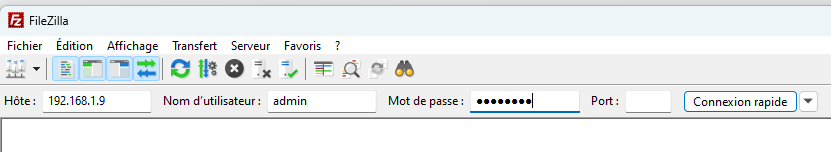
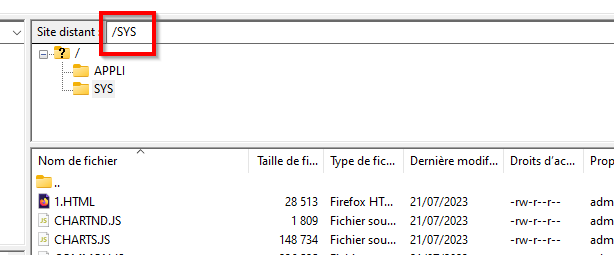
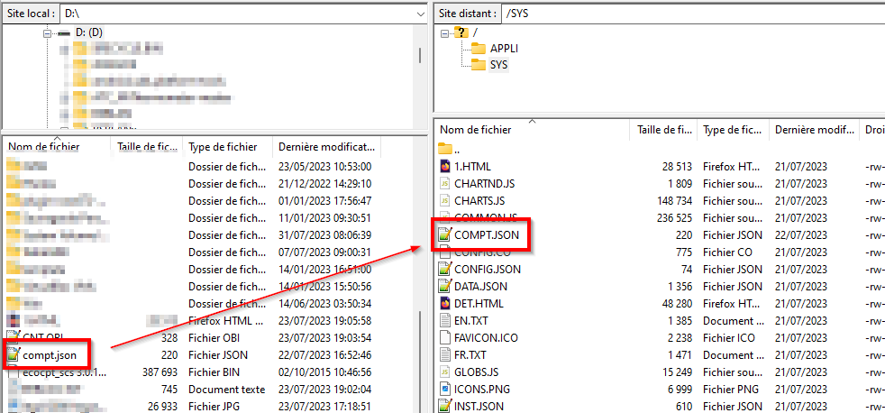
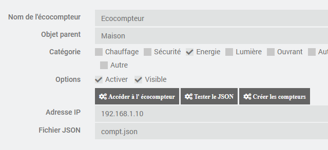
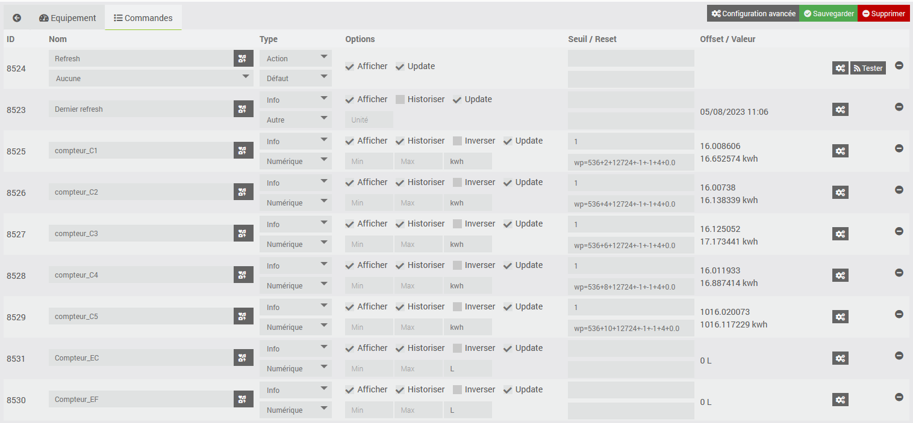
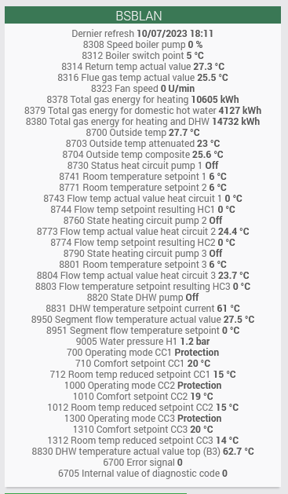
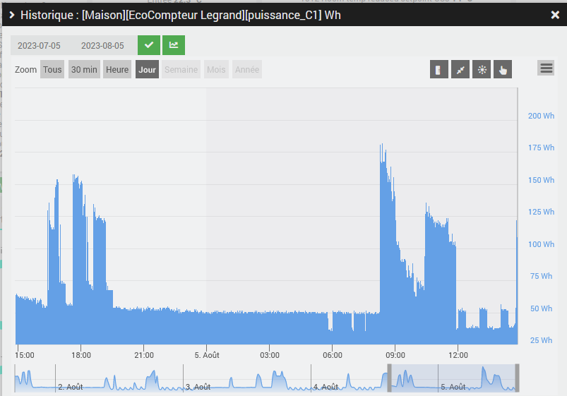
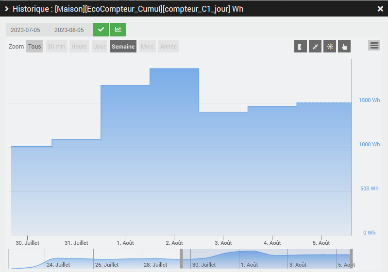

# Plugin EcoLegrand

Plugin permettant de récupérer les données des écocompteurs Legrand d'ancienne génération (référence 412000). 

Contrairement aux nouveaux écocompteurs dont les données ne sont accessibles qu'à travers le cloud, les anciens écocompteurs peuvent être accédés via une interface WEB locale. En particulier, on peut visualiser directement la consommation instantanée ce qui n'est pas possible avec les nouveaux écocompteurs (il faut visualiser les données directement sur l'écocompteur).

Les écocompteurs 412000 ne sont plus commercialisés depuis 2020 mais ils gardent tout leur intérêt comparés à la version actuelle.

La communication entre le plugin et l'écocompteur s'effectue en récupérant les données de fichiers JSON définis par l'utilisateur. L'utilisateur définit lui-même dans le fichier JSON les données qu'il souhaite récupérer.

La fonction de base du plugin est la récupération des données des écocompteur. Leur exploitation doit être faite par d'autres moyens (virtuels, scénarios, ...) et nécessite une certaine maitrise de Jeedom afin de pouvoir manipuler les données.

# Installation et configuration de l'écocompteur EcoLegrand

Le bon fonctionnement du plugin suppose que l'écocompteur soit opérationnel et accessible via l'interface WEB.

Le plugin a été testé avec la  version 3.0.17 qui est la dernière publiée et n'évoluera plus étant donné que cet écocompteur n'est plus maintenu.

# Définition des données à récupérer dans un fichier JSON

{  
"compteur_C1":~LG536 2 12724$,  
"compteur_C2":~LG536 4 12724$,  
"compteur_C3":~LG536 6 12724$,  
"compteur_C4":~LG536 8 12724$,  
"compteur_C5":~LG536 10 12724$,  
"Compteur_EF":~LG538 0 12907$,  
"Compteur_EC":~LG538 1 12907$  
}

Le fichier JSON a la forme ci-dessus. Il y a une ligne par donnée à récupérer (attention à ne pas mettre de virgule sur la dernière ligne).

Chaque ligne comprend le nom de la donnée et la référence interne définie dans l'écocompteur. Le fichier en lien <https://bernard-dandrea.github.io/jeedom-EcoLegrand/fr_FR/JSON_Codes.txt> donne une liste non exhautive des références utilisables.

Vous pouvez vous reporter au forum suivant <https://easydomoticz.com/forum/viewtopic.php?t=1942&start=20> pour avoir plus d'informations.

# Copie du fichier JSON sur l'écocompteur

La copie s'effectue via le protocole FTP. Le programme FileZilla peut être utilisé.

Se connecter en indiquant l'adresse IP et les codes d'accès (par défaut admin / password ).

Se positionner sur le répertoire SYS.

Copier le fichier JSON. Noter que son nom doit être assez court sinon la copie ne se fait pas.

Dans le répertoire SYS se trouvent les fichiers HTML utilisés par l'écocompteur. Vous pouvez trouver en les analysant la référence aux variables qui vous intéresse.

# Problème avec les compteurs d'énergie

Le forum ci-dessus explique très bien la problématique rencontrée avec les compteurs d'énergie (les compteurs à impulsion ne sont pas concernés).

Il semble que le logiciel de l'écocompteur gère en interne ces compteurs avec des variables de type float 32. Celles-ci ont une précision d'environ 7 décimales.

Ces compteurs sont mis à jour toutes les secondes et sont gérés en KWh sur 6 décimales.

De ce fait, lorsque l'on dépasse les 10 kWh, on commence à perdre de la précision notamment si il y a peu de consommation sur la ligne concernée. Cela devient très pénalisant lorsque l'on dépasse les 100 kWh.

Pour remédier à ce probème, le plugin peut remettre les compteurs à zéro à partir d'un seuil défini par l'utilisateur (typiquement de 1 à 10 kWh). Le plugin gère le décalage et fournit une valeur cumulée du compteur. Noter que cette remise à zéro du compteur interne peut perturber les statistiques fournies par l'écocompteur. 

# Installation du plugin

Une fois le plugin installé, il faut l'activer.

Vous pouvez activer le niveau de log Debug pour suivre l'activité du plugin et identifier les éventuels problèmes.

# Configuration des équipements

La configuration des équipements est accessible à partir du menu du plugin (menu Plugins, Energie puis Ecocompteur Legrand). 

Cliquer sur Ajouter pour définir un écocompteur.

Indiquer la configuration de l'écocompteur :

-   **Nom** : nom de l'écocompteur
-   **Objet parent** : indique l’objet parent auquel appartient l’équipement
-   **Catégorie** : indique la catégorie Jeedom de l’équipement
-   **Activer** : permet de rendre l'équipement actif
-   **Visible** : le rend visible sur le dashboard
-   **Adresse IP** : IP de l’équipement
-   **Fichier JSON** : fichier JSON contenant la définition des données à récupérer

Les boutons suivants permettent les fonctions suivantes:

-   **Accéder à l'écocompteur** : permet d'ouvrir une session WEB sur l'écocompteur
-   **Tester le JSON** : permet de tester le fichier JSON et vérifier si les paramètres retournés sont corrects
-   **Créer les compteurs** : génére les commandes info correspondants aux compteurs

# Commandes associées aux équipements

Par défaut, deux commandes sont créées :

- Dernier Refresh : indique quand la dernière information de l'écocompteur a été mise à jour
- Refresh : permet de forcer la récupération des compteurs. Un daemon lance la mise à jour toutes les minutes.

Une commande info est créée pour chacun des compteurs. Pour chacun d'eux, on trouve en plus des champs habituels de jeedom :

- la coche update qui permet de demander ou non la mise à jour du compteur
- le seuil qui est la valeur à partir de laquelle le compteur est remis à zéro
- la commande qui remet à zéro le compteur
- l'offset qui est la valeur cumulée du compteur lors de la remise à zéro
- la valeur actuelle du compteur (offset + valeur du compteur dans l'écocompteur)

La commande qui permet la réinitialisation des compteurs et du type http://192.168.1.xxx/wp.cgi?wp=536+X+12724+-1+-1+4+0.0 soit wp.cgi? suivi des références du compteurs et de valeurs fixes par exemple wp=536+2+12724+-1+-1+4+0.0 pour compteur_C1. Voir le forum <https://easydomoticz.com/forum/viewtopic.php?t=1942&start=120> pour plus d'informations.

# Widget

Voici un exemple de widget. Noter qu'il faut indiquer les unités soi-même au niveau de la commande. 

# Exploitation des données

Via des scénarios, virtuels ou des procédures PHP, il est possible de produire ses propres indicateurs issus des compteurs.

Par exemple, on peut produire un relevé de la puissance basé sur le calcul de la puissance moyenne entre deux mesures.

Ou produire des relevés journaliers de consommation électrique.

